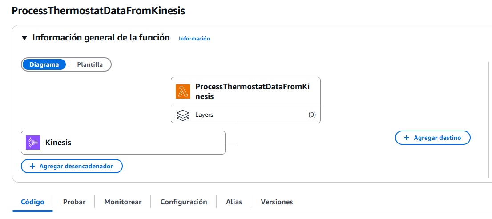
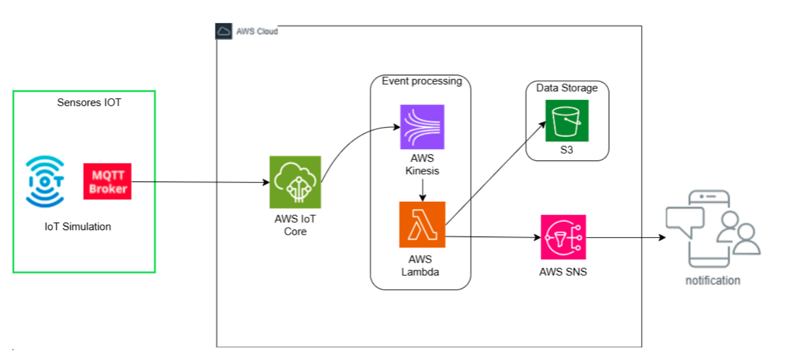
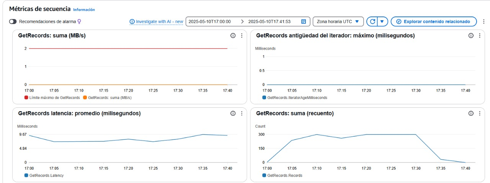
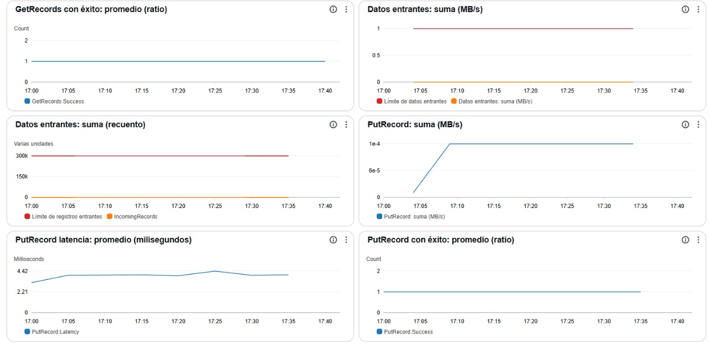
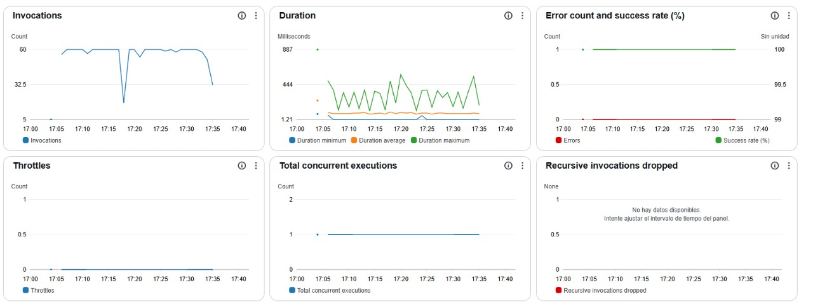
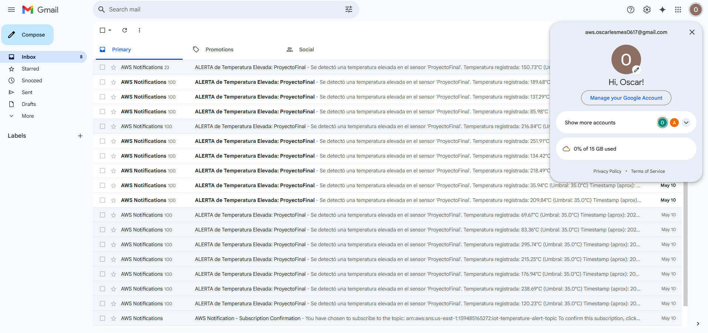

# Sistema de Prevención de Incendios con Arquitectura Distribuida en la Nube con Servicios AWS
 
El desarrollo del prototipo tiene como objetivo validar la funcionalidad del sistema propuesto para la detección temprana y prevención de incendios mediante
tecnologías de Internet de las Cosas (IoT), procesamiento en la nube. Esta versión inicial del sistema permite probar la recopilación de datos en tiempo real, su procesamiento y la activación de alertas
automáticas cuando se detectan condiciones de riesgo.
El prototipo ha sido diseñado utilizando la infraestructura de Amazon Web
Services (AWS), lo que garantiza una arquitectura escalable, segura y eficiente. La implementación se basa en un flujo de datos estructurado que abarca
desde la captura de información en campo hasta el envío de notificaciones a los
equipos de respuesta.




### Prerrequisitos

Necesitas para probarlo, una instancia de Kinesis, Lambda, SNS y S3 junto python:
1. Python
    ```
    py --version
    ```
    Deberia salir algo asi:
    ```
    Python 3.13.2
    ```
2. Dependencias de python
    ```
    pip install boto3
    pip install paho-mqtt
    ```

## Desarrollo

A continuación tenemos la arquitectura del prototipo:



### Sensor Fuego Incendio Simulado
En nuestro prototipo tendremos la simulación de un dispositivo IoT en donde se simula el envío de mensajes por medio de un cliente MQTT que se conecta directamente a la infraestructura de AWS IoT Core, simulando el comportamiento del dispositivo.

### AWS IoT Core
Es el servicio encargado de gestionar la comunicación entre el sensor y la nube. AWS IoT Core proporciona una plataforma segura para la transmisión de datos, garantizando la autenticación de dispositivos y la integridad de la información.

### Procesamiento de Datos en Tiempo Real
El sistema procesa la información recopilada mediante Amazon Kinesis, un servicio que permite el análisis de datos en streaming. Este componente se encarga de filtrar y organizar la información antes de su análisis avanzado.

### AWS Lambda
Para mejorar la precisión en la detección de incendios, el sistema incorpora AWS Lambda la cual es disparada por medio del procesamiento de datos en Kinesis, en donde si se supera el umbral de temperatura dispara una alerta por medio de SNS.

### Notificación de Alertas con Amazon SNS
Cuando se detecta una anomalía que podría indicar un incendio, el sistema activa automáticamente Amazon Simple Notification Service (SNS). Este servicio envía alertas instantáneas a los equipos de emergencia y comunidades cercanas a la zona de riesgo.

### Almacenamiento de Datos
Los datos recopilados se almacenan en la nube para su posterior análisis. En el prototipo, se emplea un almacenamiento S3 que permite conservar la información relevante como la fecha, hora, temperatura, nombre del sensor y umbral límite.

## Resultados

En este [link](https://youtu.be/bfPR2rk7-RM) puedes encontrar una demostración del prototipo.

A la hora de probar nuestro prototipo haciendo uso de la simulación de un sensor IoT con el script `SolicitudesIoT.py` obtuvimos las siguientes métricas de uso de Lambda y Kinesis junto a las respuestas de nuestro prototipo:

### Kinesis



### Lambda


En primer lugar, se analizaron las métricas correspondientes al componente de procesamiento en la nube basado en funciones AWS Lambda. Durante el período de monitoreo, se registró una frecuencia estable de entre 50 y 60 invocaciones por intervalo, lo cual evidencia un flujo sostenido y constante de eventos generados por los sensores IoT. La duración promedio de las ejecuciones se mantuvo entre 200 y 300 milisegundos, con un valor máximo observado de 887 milisegundos, sin que ello impactara la disponibilidad del sistema. Cabe destacar que la tasa de éxito en las invocaciones fue del 100 por ciento, sin presencia de errores ni registros de throttling, lo que sugiere un manejo eficiente de los recursos asignados. Asimismo, las ejecuciones concurrentes se mantuvieron entre uno y dos procesos paralelos, lo cual indica que el sistema operó por debajo de su capacidad máxima, permitiendo escalar ante mayores volúmenes de eventos sin comprometer el rendimiento.

### Mensajería

El objetivo de este prototipo es recibir las alertas para que un usuario pueda tomar decisiones, por lo que al finalizar las mas de mil pruebas realizadas, obtuvimos el siguiente resultado:



Podemos observar que obtuvimos varias alertas tempranas sobre un posible incendio, obteniendo exito en nuestro prototipo.

## Conclusión

En conclusión, la propuesta de un sistema de prevención de incendios basado en una arquitectura distribuida en la nube con AWS representa una solución innovadora y efectiva para la detección temprana y mitigación de incendios en Colombia. La combinación de tecnologías avanzadas con modelos predictivos y automatización de alertas mejora la capacidad de respuesta ante emergencias y optimiza la gestión de recursos. Este enfoque no solo contribuye a la reducción del impacto ambiental de los incendios, sino que también fortalece la resiliencia de las comunidades ante eventos catastróficos, sentando las bases para futuras implementaciones a nivel nacional e internacional.

## Construido con

* [GIT](https://git-scm.com) - Version control

## Versionamiento

Nosotros usamos [GitHub](http://github.com).

## Autores

* **Oscar Santiago Lesmes Parra** - [oscar0617](https://github.com/oscar0617)
* **Jeisson Steban Casallas Rozo** - [jeissoncasallas09](https://github.com/JeissonCasallas09)
* **Milton Andres Gutierrez Lopez** - [MiltonGutierrez](https://github.com/MiltonGutierrez)

Date: 16/05/2025

## Licencia

Este proyecto tiene licencia del GNU.
